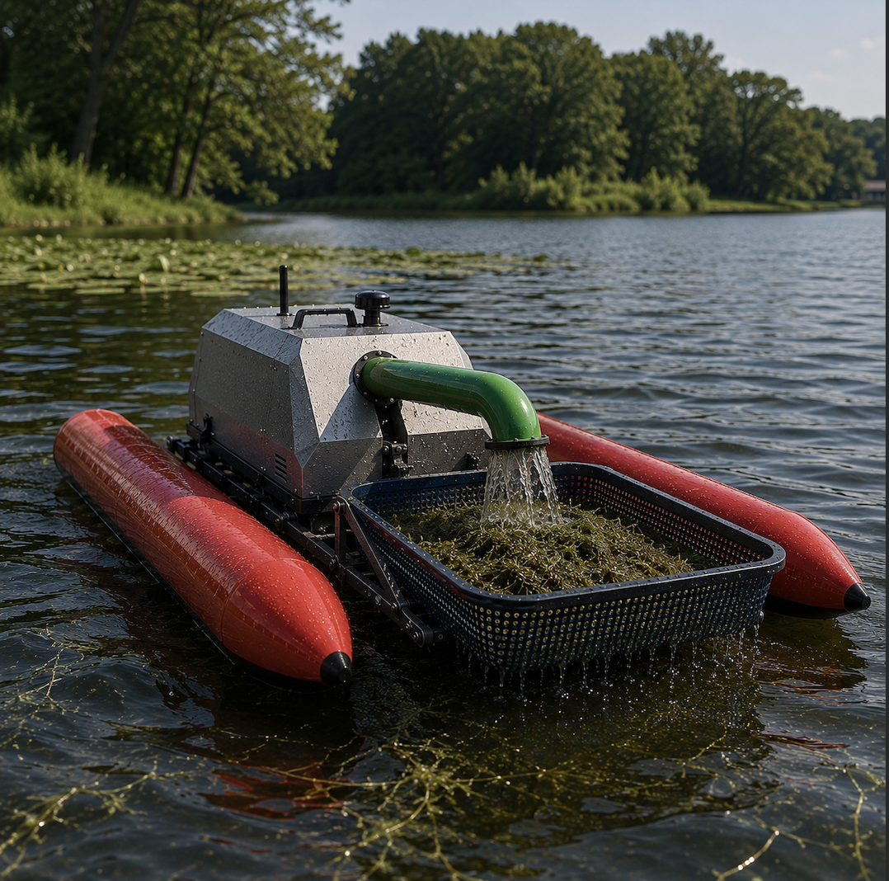

# Autonomous Aquatic Robot for Invasive Vegetation Management

## Overview
This project is an ongoing research and development effort focused on building a fully autonomous aquatic robot for managing biomass in aquatic environment. The system is being developed as part of the Collective Embodied Intelligence Laboratory at Cornell University. 

In parallel with the technical development, the project is being explored for commercialization, with ongoing customer discovery and participation in entrepreneurship and startup accelerator programs. 

The robot is designed as a self contained underwater and abovewater intervention platform, combining sensing, interaction, and onboard collection to reduce fragmentation and regrowth commonly associated with existing mechanical removal methods.

## Conceptual Design

The figure above shows an **early-stage conceptual model** and does **not** represent the final mechanical design.

The platform architecture emphasizes modularity and coordinated underwater operation, with the goal of enabling vegetation removal at any depth and location rather than being limited to surface based harvesting.

## Project Scope
The goal of this project is to demonstrate a cohesive autonomous system capable of:

- Operating in shallow aquatic environments
- Interacting directly with submerged vegetation
- Coordinating cutting, handling, and collection below the waterline
- Retaining biomass onboard to limit downstream dispersal

## Current Development Focus
Active work on this project includes:

- Integrating an underwater manipulator end effector for targeted interaction
- Developing a unified underwater module that coordinates sensing cutting, pumping, and collection
- Field test and iteration

# STAY TUNED! 

### Interested? 
### Contact: mh2668@cornell.edu for more details. 