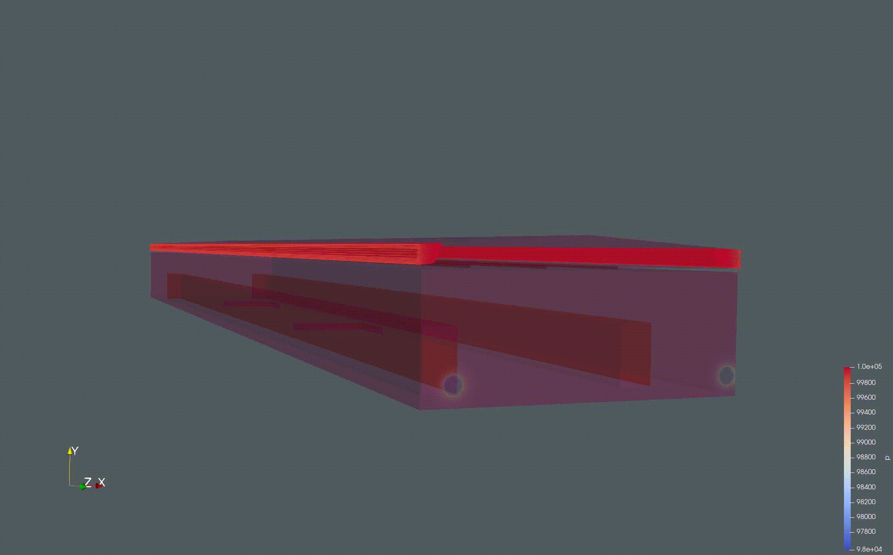

# BarnFlowDynamics

## Introduction

BarnFlowDynamics is a simulation project using open source software "OpenFOAM" for modeling airflow dynamics and heat transfer in a Large-scale agricultural environment. This project was created and developed by **Mr. M H** and The redirect gitlab respo contains the source code, configuration files, mesh generation files and animation results.

## Download OpenFOAM (v2206)

Linux, Windows and macOS: [HERE](https://openfoam.org/download/) 

Native OpenFOAM for macOS: [HERE](https://github.com/gerlero/homebrew-openfoam) 

## Models
All models tested/built with two industrial fans

1. [Model 1](https://gitlab.msu.edu/huangm23/barnflowdynamics/-/tree/main/model%201): Empty barn - airiflow only

2. [Model 2](https://gitlab.msu.edu/huangm23/barnflowdynamics/-/tree/main/model%202): barn with fake cages and 84 ceiling fans - airflow and heat transfer

3. [Model 3](https://gitlab.msu.edu/huangm23/barnflowdynamics/-/tree/main/model%203): standard barn with equipment - airflow and heat transfer 

Model Guide: 

All models tested/built with two industrial fans
- [ ] [0](https://gitlab.msu.edu/huangm23/barnflowdynamics/-/tree/main/model%202/0) folder contains the files that define the initial conditions and boundary conditions for the simulation variables.

- [ ] [constant](https://gitlab.msu.edu/huangm23/barnflowdynamics/-/tree/main/model%202/constant) folder contains the geometry and material properties for the simulation.

- [ ] [system](https://gitlab.msu.edu/huangm23/barnflowdynamics/-/tree/main/model%202/system) folder contains the files that control the numerical methods, solvers, and meshing process.

## Tools

1. The [Allrun](https://gitlab.msu.edu/huangm23/barnflowdynamics/-/blob/main/Tools/Allrun?ref_type=heads) script: 

Located in the Tools directory, automates the execution of all necessary commands for setting up and running the simulations(needs small ajdustment based on the case). This script is designed to streamline the workflow for cases that are already configured and ready for visualization.

2.  [foamMonitor](https://gitlab.msu.edu/huangm23/barnflowdynamics/-/tree/main/Tools/foamMonitor?ref_type=heads)

Located in the Tools directory, contains a real-time residual plotting test case that demonstrates how to monitor simulation progress interactively through graphical visualization.

For MacOS users: Download [X11](https://www.xquartz.org)

## Post-processing GUI

[Paraview](https://www.paraview.org/download/) is the primary GUI used for post-processing simulation results for this project. 

## Project Status

⚠️ **Development Status:** The development of this project has slowed down due to hardware limitations and Time / resource constraints. While significant progress has been made, certain aspects of the project could not be completed or optimized.

If you are interested in contributing, forking, or helping with the hardware and computational challenges, feel free to reach out to me at [ming1024huang@gmail.com](mailto:ming1024huang@gmail.com).

